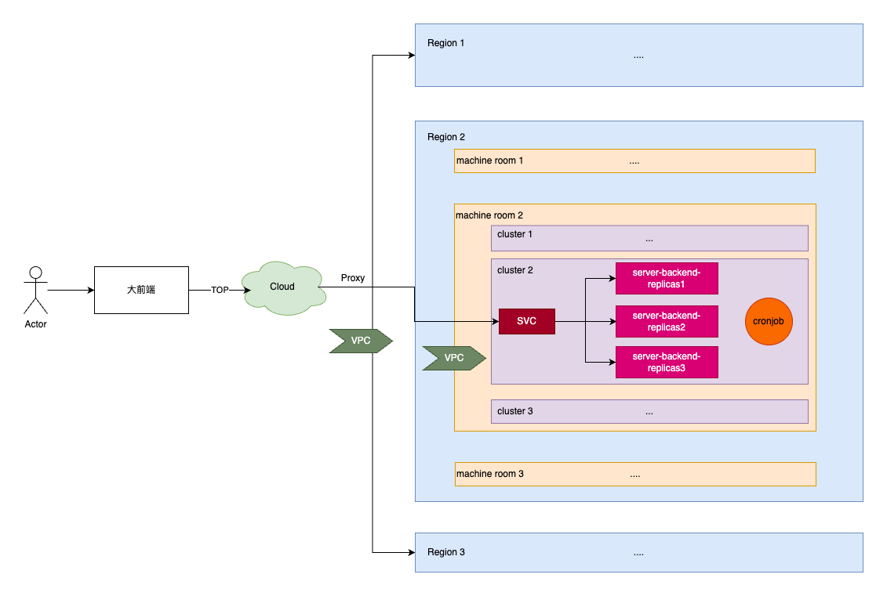
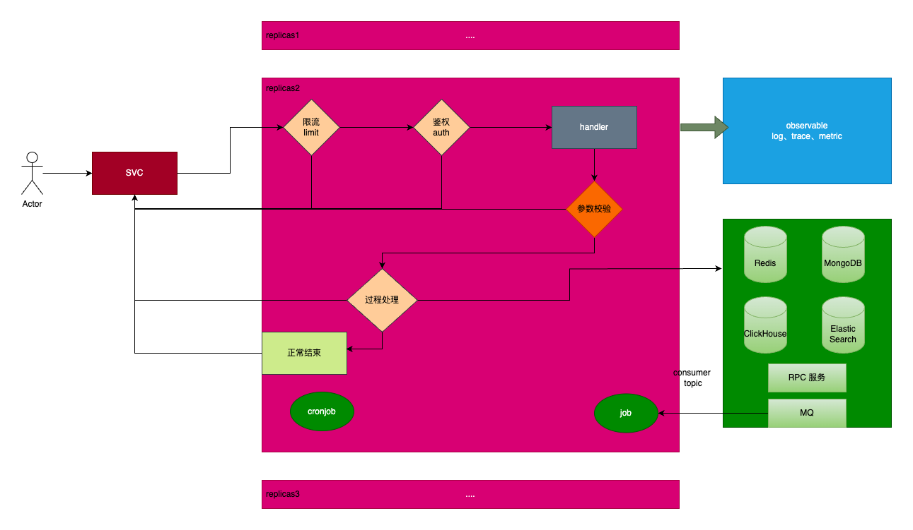

# 概述

软件架构师负责设计和规划复杂系统的结构和框架，参与需求分析和功能定义，理解系统的业务目标和技术要求，并在整个开发过程中提供技术指导和解决方案，以确保系统的可靠性、可扩展性和性能。需要具备广泛的技术知识，包括软件开发、数据库设计、网络架构等方面的知识。他们需要了解不同的技术平台和框架，并能够评估和选择适合项目需求的技术解决方案。还需要具备良好的沟通和协调能力，能够与项目团队、业务部门和其他利益相关者进行有效的沟通和合作，确保系统按照设计规范和标准进行开发和交付。

> 毒鸡汤：车马春山慢慢行

# 上云简单架构图

- 要有 `TOP网关`、`多区域`、`多机房`、`多集群`、`多副本`的概率
  - 禁止在replicas里执行修改的公共数据的定时任务, 多副本服务如果涉及修改的定时任务，需要拎出来单独创建

# 服务架构图

- 注重系统横向扩展能力
- 注重系统安全、数据安全
- 注重可观测性

# 根据项目场景选择数据库

- 多修改存储：`MongoDB`（建议）、`MySQL`、`Postgres`
- 多查询存储：`ClickHouse`（建议）、`ElasticSearch` （建议）、`Redis`（建议）

# 消息队列

`RocketMQ`（建议）、`RabbitMQ`、`Kafka`

